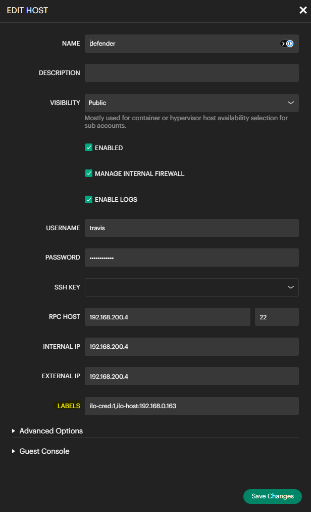

# morpheus-argus — an iLO tab for Morpheus that actually shows you the server

A Morpheus 9.0 plugin that adds an **iLO** tab to every HPE ProLiant host
detail page. It reads live status from HPE iLO over Redfish — power,
health, thermals, network identity, drives, DIMMs, RAID volumes, firmware
inventory, events, sessions — surfaces the configured credentials for
copy/paste, and launches the IRC HTML5 console in one click,
pre-authenticated, in a new window. Repo:
[`github.com/builtbyfood/morpheus-argus`](https://github.com/builtbyfood/morpheus-argus).

> [] 

---

## Why it exists

Morpheus has a *Console* tab on every host, but for HPE ProLiant hosts
that tab only opens a SSH/RDP/VNC to the OS. There is no native way to
reach iLO from inside Morpheus — and iLO is exactly where you want to be
when the OS is broken, the boot order is wrong, you need to flip BIOS
settings, or a tech in the rack needs you to identify which server they
should be physically looking at.

The usual workaround is a browser bookmark to each iLO's IP plus a
shared 1Password vault for the BMC creds. That works, but only at
small scale, and it leaves a real workflow gap: **a Morpheus operator
shouldn't have to leave Morpheus to look at the box.**

So: a tab that shows the iLO data Morpheus doesn't surface, with a
one-click launch into the IRC HTML5 console using the iLO credential
that's already stored in Morpheus's Trust → Credentials.

---

## What you get

| Card | What it shows |
| --- | --- |
| **System** | Power state, health, iLO firmware, BIOS version, CPU, memory, serial, asset tag, SKU, indicator LED state, TPM, boot progress + boot override, hostname |
| **Power & Cooling** | Current power draw (with average fallback), PSU count + redundancy, hottest CPU temperature, ambient temperature, fan summary — all temperatures in °C / °F |
| **Power Trend** | Inline SVG sparkline of historical power draw + current/min/avg/max gauge. Skipped on hardware that doesn't track power |
| **Network** | Host MAC + IP + link, iLO MAC + IP + hostname, iLO date/time, iLO license type |
| **Network Adapters** (collapsible) | Per-adapter model, manufacturer, serial, firmware, health. Per-port table with link state, speed, MAC |
| **NIC Port LEDs** | At-a-glance colored dot per port — green LinkUp · gray LinkDown · yellow Warning · red Critical |
| **Drives** | Per-drive model, media type, location, capacity, temperature, lifetime power-on hours, health (with ⚠ on predicted failure) |
| **Volumes / RAID** | Per-volume RAID type, capacity, drive count, health, in-progress operation %, encryption, boot-volume star. Skipped when no controller present |
| **DIMMs** (collapsible) | Per-slot capacity, speed, type, manufacturer, part number |
| **Cooling Zones** (collapsible) | All temperature sensors iLO knows about — CPU, ambient, DIMMs, PCIe slots, drive bays, M.2, VRMs |
| **Firmware Inventory** (collapsible) | Every firmware component iLO can see — version, updateable flag |
| **Active iLO Sessions** (collapsible) | Other users currently logged into this iLO — useful before launching IRC |
| **Recent Events** (collapsible) | Last 5 Integrated Management Log entries with severity coloring |
| **Buttons** | Show credentials · ▶ Launch Console · → Open Console |

> []
> []

Every card is independent. If one Redfish endpoint is missing, slow, or
returns malformed data, that card alone is skipped — the rest of the
tab still renders.

---

## The one-click launch

Click **▶ Launch Console**. A new browser window opens, briefly shows
iLO's JSON login response, then auto-navigates to `/irc.html`
authenticated, no login prompt.

This is harder than it sounds, and the path to making it work was the
single most interesting part of the project. The constraints stacked:

1. **iLO sets `X-Frame-Options: SAMEORIGIN`** — no iframe-based
   embedding inside the Morpheus tab. The console has to open in a new
   window.
2. **Morpheus's CSP is `script-src 'self' 'nonce-XXX' 'strict-dynamic'`** —
   under `strict-dynamic`, only scripts carrying the per-request nonce
   execute. No inline `onclick` handlers. No `<script>` blocks without
   a nonce. The plugin emits raw HTML from a server-tab provider, so
   getting that nonce into the markup is non-trivial.
3. **Browser cookie policy.** iLO's `sessionKey` is `SameSite=Lax` by
   default, which means it survives a top-level cross-origin form POST
   but is dropped on certain other navigation patterns. Brave's
   shields, Firefox's strict tracking protection, and iLO instances
   configured with `SameSite=Strict` all behave differently.
4. **iLO's Redfish `X-Auth-Token` is the wrong kind of session.** It's
   useful for `GET`s on `/Systems/1` etc., but the IRC console doesn't
   honor it — the console uses iLO's *web* session cookie, set by
   `POST /json/login_session`. So you can't authenticate via Redfish on
   the server side and hand the token to the browser.
5. **The Morpheus controller routes returned 403.** I spent six plugin
   versions trying to register a server-side route to broker the iLO
   login — the route would load, but every request returned `403
   Forbidden` regardless of which permission code was declared on it.
   At least six valid-looking permission codes were tried; none worked.

The shape that ended up working sidesteps all five at once:

- A plain HTML `<form enctype="text/plain">` with one hidden input
  whose `name` + `=` + `value` concatenate to a valid JSON body. iLO's
  parser accepts it. The form POSTs cross-origin straight to the iLO's
  `/json/login_session` in a new popup window. No server-side
  brokering, no controller route, no Redfish session token shuffle.
- A small inline `<script nonce="…">` that pre-opens the popup during
  the click's user-activation grant and schedules a `setTimeout` to
  navigate the popup to `/irc.html` ~1.5 seconds after the form-POST
  completes. The nonce is read from Morpheus's Spring
  `RequestContextHolder` at render time.
- A companion **→ Open Console** button that navigates the existing
  popup manually. If the nonce isn't readable for any reason, the JS
  bridge silently doesn't render and the two-click flow takes over.
- A pure HTML/CSS **Show credentials** reveal as the deepest fallback —
  no JavaScript, no network, works under any browser policy.

The architecture is straightforward but the *constraints* are what
make the code shape strange. Every odd-looking choice — the
text/plain JSON injection, the CSS-only credential toggle, the
absence of controller routes — is there because of one of those five
constraints.

> []

---

## The status panel

Renders inside ~1–2 seconds of opening the tab. The plugin:

1. Reads `ilo-host:` and `ilo-cred:` labels from the host.
2. Loads the configured credential via Morpheus's `AccountCredential`
   service.
3. `POST /redfish/v1/SessionService/Sessions` to iLO with username +
   password — receives an `X-Auth-Token`.
4. Reads `/Systems/1`, `/Managers/1`, `/Chassis/1`, `/Processors/1`,
   `/Memory`, `/EthernetInterfaces/1`, `/Storage/<n>/Drives`,
   `/Storage/<n>/Volumes`, `/NetworkAdapters/<n>` (and each adapter's
   `NetworkPorts`), `/Power/PowerMeter`, `/EnvironmentMetrics`,
   `/Thermal`, `/UpdateService/FirmwareInventory`, `/Sessions`,
   `/LogServices/IML` — about 15-20 GETs per render in a typical case.
5. `DELETE /SessionService/Sessions/<id>` in a `finally` block.

Each read is wrapped in its own try-catch. If one endpoint 404s, only
that card hides. If a sort closure trips over a sensor with a null
name, the partial-data error is surfaced in a Diagnostics row instead
of blanking the whole tab.

> []

---

## What it deliberately doesn't do

**No power on / off / reset buttons.** Two reasons:

- The IRC console already exposes them. Once the IRC window is open,
  iLO's own toolbar has Power → Momentary Press / Press and Hold /
  Cold Boot / Reset, with graceful-shutdown variants in the dashboard.
  A parallel set of buttons in the Morpheus tab would just be a thinner
  duplicate of what iLO does better.
- It depends on the iLO user's privileges anyway. The Redfish reset
  action requires the iLO account to have the **Virtual Power and
  Reset** bit (`reset_priv:1`). An account without it gets HTTP 403 on
  the action regardless of where the button lives. Grant or revoke
  power control on the iLO user account directly.

**No iframe-embedded console.** iLO's `X-Frame-Options: SAMEORIGIN`
prevents this and isn't reasonably workable around. Console opens in
its own window.

**No controller routes / no custom permissions.** The plugin
declares nothing, registers nothing. The tab inherits the same
permissions as the Morpheus host detail page it sits on. This was
forced by the unresolved controller-403 saga but ended up being a
nice simplification.

---

## Configuration

Per-host labels in Morpheus (free-form `key:value` tags):

| Label | Required? | Example |
| --- | --- | --- |
| `ilo-host:<ip-or-host>` | yes | `ilo-host:10.0.10.50` |
| `ilo-cred:<credential-id>` | yes | `ilo-cred:1` |
| `ilo-verify-ssl:<true\|false>` | no, default true | `ilo-verify-ssl:false` |
| `ilo-readonly:<true\|false>` | no, default false | `ilo-readonly:true` (hides credentials + launch UI, status cards still render) |

After saving labels, refresh the host page — the iLO tab appears and
the status panel populates.

> []

No role grants are required. No custom permissions are declared.

---

## Lessons that shaped the code

These came out of the build and are worth writing down because they're
the kind of thing you have to learn the hard way:

- **Morpheus plugin-api 1.3.1's `accountCredential.get(Long)` is
  broken.** Use `listById(Collection<Long>, Long accountId)` followed
  by `loadCredentialConfig(AccountCredential)` to actually get the
  username + password back. The `get()` method returns a `Maybe` that
  doesn't resolve.
- **`hasCustomRenderer()` must return the boxed `Boolean`** (not
  primitive `boolean`) for Morpheus to honor it. Get this wrong and
  your `renderTemplate()` is never called.
- **`Route.build` takes a single `Permission`**, not a `List<Permission>`,
  despite the docs. Mis-typing it crashes plugin registration with a
  cryptic `MissingPropertyException`.
- **HBS template model binding is empty in Morpheus 9.0** under
  `HandlebarsRenderer`. The reliable path is to build raw HTML inline
  and return it via `HTMLResponse.success(html)`.
- **HPE removed `HpeSmartStorage` from iLO 6.** Code paths that worked
  on iLO 4/5 (`/Systems/1/SmartStorage/...`) are 404s now. Drive
  enumeration goes through `/Systems/1/Storage/<n>/Drives` instead.
- **Drive enumeration on entry-tier ProLiants needs HPE's Agentless
  Management Service** running on the host OS. Without it, the chipset
  SATA controller returns no drives. Not a bug — by design.
- **iLO 6 on entry-tier hardware returns 0 for power-draw sensors that
  don't exist** rather than null. Treating "0" as "not reported" is the
  only way to render this cleanly.
- **Morpheus's CSP nonce can be read from Spring's
  `RequestContextHolder`** via reflection from a server-tab provider —
  it's exposed as the `js-nonce` request attribute. This is the only
  way to get inline JS to execute under `strict-dynamic`.
- **Always uninstall before re-uploading a JAR.** Morpheus's plugin
  hot-replace can leave stale state and you'll see duplicate tabs,
  zombie routes, or the old version's behavior. Admin → Plugins →
  Uninstall, then upload.
- **Single-letter Groovy closure params shadow enclosing scope
  silently.** A `Map p` closure param inside a method that already has
  a `Plugin p` will compile fine on Groovy 2.4 (which Ubuntu ships) and
  fail hard on the project's Groovy 3.0.21. Use descriptive param
  names; never trust the sandbox parser as the final word.

---

## Roadmap

Not yet implemented, in priority order:

1. **iLO 4 support** — check `Managers/1.FirmwareVersion` and switch
   the IRC URL from `/irc.html` to the iLO 4 path.
2. **Configuration UI** — replace label-driven config with a real
   plugin option-type form. Mostly polish; labels work and have
   their own advantages (scriptable, bulk-settable, searchable).
3. **Indicator LED toggle** — single button in the System card to
   flip the chassis identifier LED on/off via `PATCH /Chassis/1`.
   Useful when you're physically at the rack identifying a specific
   server. Blocked on solving the controller 403, since this is a
   write action and can't go through the browser.
4. **Multi-iLO inventory view** — a separate dashboard provider that
   lists all iLO-managed hosts with summary status, so you can see
   what's healthy across the fleet without clicking into each host.
5. **Per-port traffic counters** — `NetworkPort.Oem.Hpe.PortStatistics`
   into a small chart on the Network Adapters card.

---

## Build + install

```bash
git clone https://github.com/builtbyfood/morpheus-argus
cd morpheus-argus
./gradlew clean shadowJar
# output: build/libs/morpheus-argus-0.1.35-all.jar
```

JDK 17 (produces Java 11 bytecode for plugin-api 1.3.1 / Morpheus 9.0).

Upload via **Administration → Integrations → Plugins → Upload Plugin**.
Confirm load with `tail -F /var/log/morpheus/morpheus-ui/current | grep ilo`.

Tested against:

- Morpheus 9.0.0 / plugin-api 1.3.1
- HPE ProLiant MicroServer Gen11, iLO 6
- Chrome 130+, Firefox 130+, Brave 1.70+

License: Apache 2.0.

Repo: [`github.com/builtbyfood/morpheus-argus`](https://github.com/builtbyfood/morpheus-argus)
